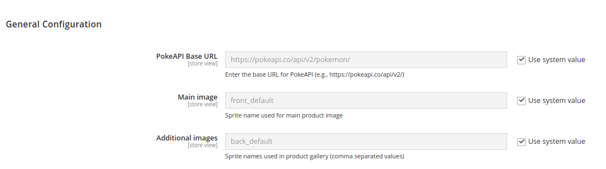
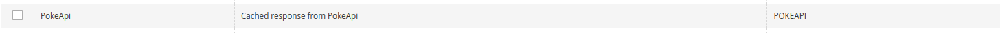
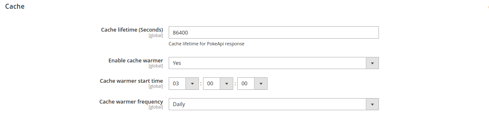
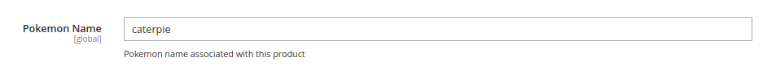

# Atma_PokemonIntegration

This module integrates with PokeAPI and enables the assignment of Pokémon (by name) to your products.

### Installation
- `composer config repositories.atma/pokemon-integration vcs https://github.com/anoli00/atma-pokemon-integration.git`
- `composer require atma/pokemon-integration`
- `bin/magento setup:upgrade`

### Configuration

Configuration is under: `Stores -> Configuration -> Atma -> Pokemon Integration`

Functionality has its own cache, added by this module.

There is a configuration to set the cache lifetime.
The module also includes a cache warmer functionality with a cron frequency configuration:

This is optional, disabled by default.

### Assigning to the product
The module adds a "Pokemon name" attribute, which is already assigned to the default attribute set:

If a product has a value in this attribute, the name and images on the Product Page and Product Listing are dynamically changed to those assigned in the API to the corresponding Pokémon.

This change is without permanently saving it to the entity, so if you remove the value from the Pokemon name attribute, the frontend will display the old name and all photos from the gallery.
